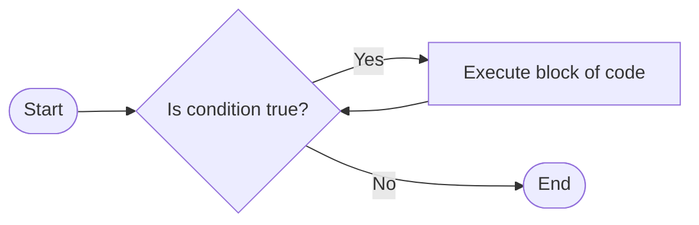
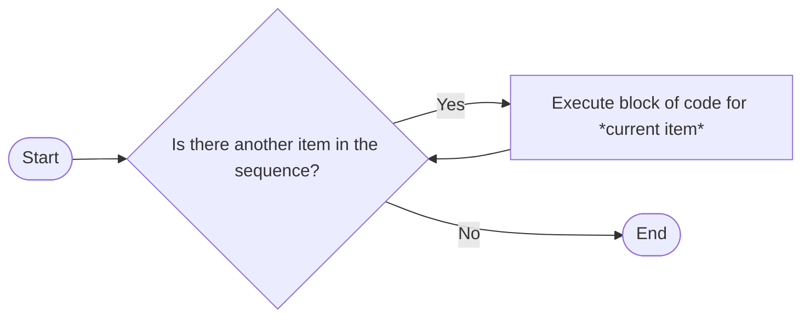
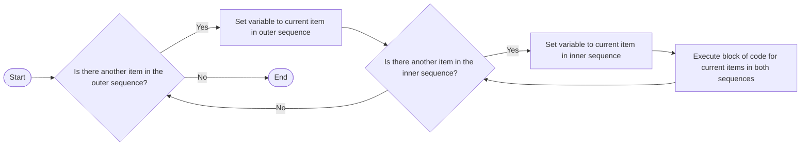

# Naming Conventions and Loops

---
layout: top-title
color: blue-light
transition: fade
zoom: 1.1
class: ns-c-tight
---

::title::

# Naming Conventions

::content::

<Admonition color="yellow-light" title="Naming Conventions from the Study Design Glossary" class="text-3xl">

A set of guidelines for providing consistency in the naming of entities during the development of digital solutions. These include program names, function names, interface controls, variable names, table names and file names. Naming conventions can minimise the effort needed to read and understand the solution or code.

</Admonition>

Naming conventions are important for readability and maintainability of code. They help developers understand the purpose of variables, functions, and other entities in the code.

## The naming conventions the study design specifically references are:

- *Hungarian Notation*
- *Camel Case*

Because we code in Python, we often also use *Snake Case*

---
layout: top-title
color: blue-light
transition: fade
zoom: 1.0
class: ns-c-tight
---

::title::

# Naming Convention Types

::content::

### Camel Case
In Camel Case, the name of a variable or function is written without spaces, and each word in the name starts with a capital letter. For example, `firstName` might indicate a variable that holds a person's first name, while `calculateTotal` might indicate a function that calculates a total.

### Hungarian Notation
In Hungarian Notation, we use CamelCase, but the name of a variable or function includes a ==prefix== that indicates its type or purpose. For example, `strName` might indicate a string variable that holds a name, while `intAge` might indicate an integer variable that holds an age and `btnSubmit` might indicate a button control that submits a form.

### Snake Case
In Snake Case, the name of a variable or function is written in lowercase letters, and words are separated by underscores. For example, `first_name` might indicate a variable that holds a person's first name, while `calculate_total` might indicate a function that calculates a total.

---
layout: top-title
color: blue-light
transition: fade
zoom: 1.1
class: ns-c-tight
---

::title::

# Naming *Pythonically*

::content::

In Python, we typically use ==Snake Case== for **variable and function names**. This is because it is the convention that is most commonly used in the Python community, and it helps to make our code more readable and consistent with other Python code.

**Classes** in Python typically use ==Camel Case==, which helps to distinguish them from variables and functions.

Other Python naming conventions include:
- **Constants** are typically written in all uppercase letters with words separated by underscores (e.g., `PI`, `MAX_SIZE`).
- **Private** variables and functions are typically prefixed with an underscore (e.g., `_private_variable`, `_private_function`). (Private variables and functions will come up later)
- **Modules and packages** are typically written in lowercase letters with words separated by underscores (e.g., `my_module`, `my_package`).

---
layout: top-title
color: purple-light
transition: fade
zoom: 1.1
---

::title::

# Quick Check for Understanding

::content::

(On your mini-whiteboard)
1. What naming convention is typically used for variable and function names in Python?
2. How is Hungarian Notation different from Camel Case?
3. Without knowing anything else, what might be the difference in a Python program between the name `total_funds` and `TOTAL_FUNDS`?

---
layout: top-title
color: blue-light
transition: fade
zoom: 1.1
class: ns-c-tight
---
::title::

# Loops

::content::

We have already done some work with loops in Python, but we will now look at them in more detail.

A loop is a programming construct that allows us to repeat a block of code multiple times. 

In Python, there are two main types of loops: **for loops** and **while loops**. 

- A **for loop** is used to iterate over a sequence (such as a list, tuple, or string) or other iterable object. It executes a block of code for each item in the sequence.
- A **while loop** is used to repeatedly execute a block of code as long as a certain condition is true.

---
layout: top-title
color: blue-light
class: ns-c-tight
---
::title::

# While Loops

::content::

While loops are probably the easier loop to understand. They repeat a block of code as long as a certain condition is true.


## Example
```python

# Example of a while loop
name = ""

while name == "":
    print("Please enter a name.")
    name = input("What is your name? ")
```

---
layout: top-title
color: blue-light
class: ns-c-tight
---
::title::

# Reasons to use a while loop

::content::

1. When we want to repeat a block of code an unknown number of times, and the loop should continue until a certain condition is met. 
2. When we want to create an infinite loop that will run until the program is terminated (e.g., a game loop).
3. When validating user input, we can use a while loop to repeatedly prompt the user until they provide valid input.

Can you think of any other reasons to use a while loop?

---
layout: top-title 
color: blue-light
class: ns-c-tight
zoom: 0.9
---
::title::

# For Loops

::content::

For loops are used to iterate **over a sequence** (such as a list, tuple, or string) or other iterable object. When we want to loop a set number of times, we  They execute a block of code for each item in the sequence.



## Example
```python
# Example of a for loop
fruits = ["apple", "banana", "cherry"]
for fruit in fruits:
    print(fruit)
```

---
layout: top-title
color: blue-light
class: ns-c-tight
zoom: 0.9
---

::title::

# Setting a variable to the current item in a for loop

::content::

In a for loop, we  set a variable to hold the **current item** in the sequence that we are iterating over. This allows us to perform operations on that item within the block of code that is executed for each iteration of the loop.

Tracking iterations
```python
# Example of a for loop that tracks the number of loops
for i in range(5):
    print(f"This is loop number {i}")
```
Reading lines from a file
```python
# Example of a for loop that reads lines from a text file
with open("example.txt", "r") as file:
    for line in file.readlines():
        print(line)
```
Using enumerate to track both the index and the current item
```python

# Example of iterating over a list while keeping track of the index
fruits = ["apple", "banana", "cherry"]

for index, fruit in enumerate(fruits):
    print(f"Index: {index}, Fruit: {fruit}")
```

<Admonition color="yellow-light" title="The variable name for the current item in a for loop can be anything!">
The variable name for the current item in a for loop can be anything, but it is valuable  to choose a name that is descriptive and meaningful. This is part of following naming conventions.
</Admonition>

---
layout: top-title
color: blue-light
class: ns-c-tight
zoom: 1.1
---
::title::

# Nesting Loops

::content::

Loops can be nested inside other loops. This means that we can have a loop inside another loop, and the inner loop will be executed for each iteration of the outer loop.



## Example
```python
# Example of nested loops
matrix = [[1, 2, 3], [4, 5, 6], [7, 8, 9]]
for row in matrix:
    for item in row:
        print(item)
```
---
layout: top-title
color: blue-light
class: ns-c-tight
---

::title::

# Reasons to use a for loop

::content::

1. When we want to iterate over a sequence of items (e.g., a list of names, a string of characters, lines in a file, collections of objects etc.).
2. When we want to perform a block of code a specific number of times (e.g., using `range()` to specify the number of iterations).
3. When we want to access both the index and the value of items in a sequence (e.g., using `enumerate()` to get both the index and the item).

Can you think of any other reasons to use a for loop?


---
layout: top-title
color: green
class: ns-c-tight
zoom: 1.3
---
::title::

# Review

::content::

What was the most important thing you learned today?

What do you need to remember?

**5 minutes to make some notes**

---
layout: top-title
color: green
class: ns-c-tight
zoom: 1.2
---

::title::

# Practice Problems

::content::

**Problems you can try yourself now:**

- Write a while loop that continues to ask the user for input until they enter a specific word (e.g., "exit").
- Write a for loop that iterates over a list of numbers and prints the square of each number.
- Use nested loops to print a multiplication table for numbers 2 through 6.
- ==Extension:== Write a for loop that finds every word in a long string, then counts the number of times each word appears and prints the results.
  - Hint: You can use a dictionary to keep track of the word counts.

**Think carefully about your variable names and follow Python naming conventions!**
---

