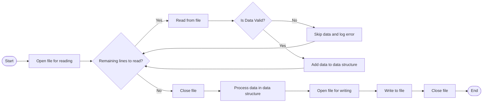

# Reading and Writing Plain Text Files

---
src: ./u3o1_tracking.md
hide: false
---

---
layout: top-title
color: blue
zoom: 1.2
class: ns-c-tight
---

::title::

# Reading and Writing Plain Text Files

::content::

## Learning Intentions

We are learning to read and write plain text files.

## Success Criteria

I can read plain text files in Python.

I can write plain text files in Python.

I can model a real-world problem using file input and output.

---
layout: top-title
color: blue
zoom: 1.2
class: ns-c-tight
---

::title::

# Program Flow - Reading and Writing Files

::content::



- We will read data from a file, process it and write the results to a second file.
- Python's `with` statement will be used to ensure files are closed after they are used.
- We will use a list to store the data read from the file, and then write the processed data to a second file.

---
layout: top-title
color: purple
zoom: 0.85
---
::title::

# Our approach - Decomposing the problem into functions

::content::

Each of those steps in the flowchart represent an action that needs to be taken. We can turn most of these into functions, to keep our code clean, readable and reusable. 

```python
def read_file(file_path: str) -> list[str]:
    # Implementation to read file and return list of lines
    return []

def validate_sales_data(input_data: list[str]) -> list[float]:
    # Implementation to validate and convert input data to list of floats
    return []

def calculate_summary(sales_data: list[float]) -> dict[str, float]:
    # Implementation to calculate total, average and max sales  
    return {"total": 0.0, "average": 0.0, "max": 0.0}

def write_summary(file_path: str, summary: dict[str, float]) -> bool:
    # Implementation to write summary to file and return success status
    return True

input_data = read_file('input_sales.txt')
sales_data = validate_sales_data(input_data)
summary = calculate_summary(sales_data)
success = write_summary('output_summary.txt', summary)
```

**Copy this setup code into a new Python file**

*Note: these functions include type hints to show the expected parameters and return types. They aren't required by Python, but they help you write clear code as well as integrating well with code editors for error checking.*

---
layout: top-title
color: purple
zoom: 1
---
::title::

# Logging - a helpful tool for debugging and monitoring

::content::

- So far we have been using `print()` statements to log messages to the console. This is useful, but inflexible.
- Python's built-in `logging` module allows you to log messages at different severity levels (DEBUG, INFO, WARNING, ERROR, CRITICAL) and can be configured to log to different destinations (console, file, etc.).
- We will use the `logging` module to log messages about the progress of our program, as well as any errors that occur during file reading and writing.

```python
import logging

# Configure basic logging: set level to DEBUG to start, add format with time, levelname, and message
logging.basicConfig(
    level=logging.DEBUG,
    format='%(asctime)s - %(levelname)s - %(message)s'
)
```
 
 **Add this logging code to the top of your Python file.**

---
layout: top-title
color: blue
zoom: 1.2
class: ns-c-tight
---

::title::

# Scenario 1: Simple Calculations from File Input

::content::

- We have a file `input_sales.txt` containing a list of numbers, one per line.
- Each line represents total sales for a day
- We want to read the file and store each value into a list. 
- If any values are negative or non-numeric, we will skip them and log an error message to the console.
- We will then calculate the total sales, max sales and min sales and write the results to a second file `sales_summary.txt`.

---
layout: top-title
color: blue
zoom: 1
class: ns-c-tight
---
::title::

# Scenario 1, Step 1: Reading from a file

::content::

The most basic way to read from a file is to use the `open()` function and the `read()` method.

```python
def read_file():
    file = open('input_sales.txt', 'r')
    data = file.read()
    file.close()
    return data
```

**We prefer to use the `with` statement when working with files**, as it ensures that the file is properly closed after it finishes, even if an exception is raised.

```python
def read_file(file_path: str) -> list[str]:
    with open(file_path, 'r') as f:
        logging.info(f"Opened file {file_path} for reading")
        return f.readlines() # we don't even store the lines in a variable": just return the result of readlines()
```

- We use the `readlines()` method reads the file to get a list of strings, where each string is a line from the file.
- We can then process each line to validate, convert it to a number and store it in a list.

---
layout: top-title
color: blue
zoom: 1
class: ns-c-tight
---
::title::

# Scenario 1, Step 2: Converting and Validating Data

::content::

1. We will create a function calledn `process_sales_data()` that takes a list of strings as input and returns a list of valid sales numbers.
2. The function will iterate through each line of input data, attempt to convert it to a float and check if it is non-negative.
3. If the conversion fails or the number is negative, we will log an error message to the console and skip that line of data.

```python

def process_sales_data(input_data):
    sales_data = []
    for line in input_data:
        try:
            sales = float(line.strip())
            if sales < 0:
                logging.info(f"Error: Negative sales value '{line.strip()}' skipped.")
                continue
            sales_data.append(sales)
        except ValueError:
            logging.error(f"Error: Non-numeric value '{line.strip()}' skipped.")
    return sales_data
```

- The `strip()` method is used to remove any leading or trailing whitespace characters from the line before attempting to convert it to a float.
- The `try-except` block is used to catch any `ValueError` exceptions that occur when trying to convert a non-numeric string to a float. **This is another method of type checking**.
- If the conversion is successful and the sales value is non-negative, it is added to the `sales_data` list, which is returned at the end of the function.

**Test your function**
---
layout: top-title
color: blue
zoom: 1
class: ns-c-tight
---

::title::

# Scenario 1, Step 3: Writing to a file

::content::

To write data to a file, we can also use the `with` statement to ensure the file is properly closed after writing. We are also going to put in a `try-except` block to catch any potential errors - writing to files often has more potential for errors than reading

```python

def write_summary(file_path: str, summary: dict[str, float]) -> bool:
    try:
        with open(file_path, 'w') as f:
            f.write(f"Total Sales: {summary['total']:.2f}\n")
            f.write(f"Average Sales: {summary['average']:.2f}\n")
            f.write(f"Max Sales: {summary['max']:.2f}\n")
    except Exception as e:
        logging.error(f"Error writing to file: {e}")
        return False
    return True
```

- The `open()` function is used with the 'w' mode to open the file for writing. If the file does not exist, it will be created. If it already exists, it will be overwritten.
- The `write()` method is used to write formatted strings to the file, which include the total, average and max sales values from the `summary` dictionary.
- If any exceptions occur during the file writing process, they are caught and an error message is logged. We return a success value (True or False)

---
layout: top-title
color: blue
zoom: 1.3
class: ns-c-tight
---

::title::
# Testing my code

::content::

- You've been testing your code as you go, now it's time to identify what good testing looks like here:
    - Testing an entirely valid file
    - Testing an entirely invalid file
    - Testing a file with a mix of valid and invalid data
    - Testing an empty file
