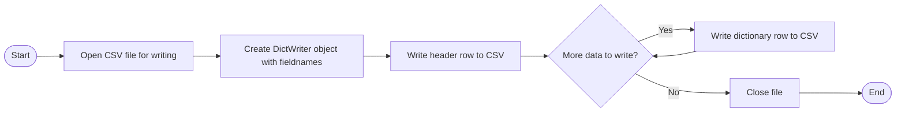

# Reading and Writing CSV Files

---
src: ./u3o1_tracking.md
hide: false
---

---
layout: top-title
color: blue
zoom: 1.2
class: ns-c-tight
---

::title::

# CSV Files

::content::

**CSV Files** are a common file format used to store tabular (table-like) data. CSV stands for **Comma-Separated Values**. Each line in a CSV file represents a row of data, and the values in each row are separated by commas. Values are often enclosed in double quotes, especially if they contain commas or other special characters.

CSV is a very popular export/import format for spreadsheets and databases, making it a common choice for data exchange.

In Python, we use the built-in `csv` module to read from and write to CSV files. This module provides functionality to handle CSV files in a way that is more robust and efficient than manually parsing the file.

```csv

Name,Age,City
Ahmed,30,Sydney
Bob,25,Los Angeles
Carlotta,35,Madrid
```

---
layout: top-title
color: blue
zoom: 1
class: ns-c-tight
---

::title::

# Reading CSV Files

::content::

To read our CSV files, we are going to use the `csv.DictReader` class. This class reads the CSV file and maps the information into a dictionary, where the keys are the column headers and the values are the corresponding data for each row.


## Absolute basics:


```python

import csv

with open('data.csv', mode='r') as file:
    csv_reader = csv.DictReader(file)
    
    for row in csv_reader:
        print(row['Name'], row['Age'], row['City'])
```

---
layout: top-title-two-cols
color: blue
zoom: 1.15
class: ns-c-tight
---

::title::

# Storing the results: list of dictionaries

::left::

A good way to store this data is as a  **list of dictionaries**, where each dictionary represents a row of data from the CSV file. 

- Each dictionary's keys correspond to the column headers
- The values in the dictionary match the data values

So for my file:

```csv
Name,Age,City
Ahmed,30,Sydney
Bob,25,Los Angeles
Carlotta,35,Madrid
```
::right::

The list of dictionaries would look like this in Python:

```python
data = [
    {'Name': 'Ahmed', 'Age': '30', 'City': 'Sydney'},
    {'Name': 'Bob', 'Age': '25', 'City': 'Los Angeles'},
    {'Name': 'Carlotta', 'Age': '35', 'City': 'Madrid'}
]
```

We create this list of dictionaries by appending the DictReader's output to a list.
```python
import csv
data = []
with open('data.csv', mode='r') as file:
    csv_reader = csv.DictReader(file)
    
    for row in csv_reader:
        data.append(row)
```


---
layout: top-title-two-cols
color: blue
zoom: 1.2
class: ns-c-tight
---

::title::

# Accessing the data

::left::

```python
data = [
    {'Name': 'Ahmed', 'Age': '30', 'City': 'Sydney'},
    {'Name': 'Bob', 'Age': '25', 'City': 'Los Angeles'},
    {'Name': 'Carlotta', 'Age': '35', 'City': 'Madrid'}
]
```
Once we have our data stored as a list of dictionaries, we can easily access specific pieces of information using the keys of the dictionaries.

- The **name of the first person** would be accessed as `data[0]['Name']` which would return "Ahmed".
- The **city of the second person** would be accessed as `data[1]['City']` which would return "Los Angeles".

::right::

If I wanted to calculate the **average age** in my file, I could:
```python

total_age = 0
for row in data:
    total_age += int(row['Age'])
average_age = total_age / len(data)
```

---
layout: top-title
color: green
zoom: 0.95
class: ns-c-tight
---

::title::

# Your Turn

:: content::

### CSV Basics

**Create a python file called `csv_sales.py` and write code to do the following:**
1. Download the `sales_data.csv` file from today's lesson plan
2. Write a function `read_csv()` to read the CSV file and return the data as a list of dictionaries
3. Write a function `total_sales()` to calculate and return the total sales from the data

### Working with larger data

**Create a second python file called `csv_afl.py` and write code to do the following:**

4. Download the `historical_games.csv` file from today's lesson plan
5. Copy and modify the `read_csv()` function from step 1 to read the historical games data and return as a list of dictionaries
6. Write code to print the column headers and the first 5 rows of data to the console
7. Write code to process the data and calculate the number of wins for each team in the dataset **by year**. For example, I should be able to tell that Fremantle won 14 games in 2010 and that Sydney won 15 games in 2017. **Identify an appropriate data structure** (combination) to return the results.

---
layout: top-title-two-cols
color: blue
zoom: 1.1
class: ns-c-tight
---

::title::

# Writing CSV Files


::left::

- To write data to a CSV file, we can use the `csv.DictWriter` class. 
- This class allows us to write dictionaries to a CSV file, where the keys of the dictionary correspond to the column headers.


::right::
## Absolute basics:

```python
import csv
data = [
    {'Name': 'Ahmed', 'Age': '30', 'City': 'Sydney'},
    {'Name': 'Bob', 'Age': '25', 'City': 'Los Angeles'},
    {'Name': 'Carlotta', 'Age': '35', 'City': 'Madrid'}
]
with open('output.csv', mode='w', newline='') as file:
    fieldnames = ['Name', 'Age', 'City']
    csv_writer = csv.DictWriter(file, fieldnames=fieldnames)
    
    csv_writer.writeheader()  # Write the header row
    for row in data:
        csv_writer.writerow(row) 
```

---
layout: top-title-two-cols
color: blue
zoom: 1
class: ns-c-tight
---

::title::

# Working with the Dictionary

::left::

Because we are storing out data as a list of dictionaries, we can easily write this data back to a CSV file using the `csv.DictWriter` class. We could have used regular write operations to write the data to a file, but using the `csv` module ensures that our data is properly formatted and that any special characters are handled correctly.

To create new fields in our output file, we can add new key-value pairs to our dictionaries before writing them to the CSV file. For example, if we wanted to add a new field called "Age Group" based on the age of each person, we could do something like this:

```python
for row in data:
    age = int(row['Age'])
    if age < 30:
        row['Age Group'] = 'Young'
    else:
        row['Age Group'] = 'Adult'
```
::right::

Then, when we write the data to the CSV file, we would include "Age Group" in our `fieldnames` list:

```python
fieldnames = data[0].keys()  
with open('output.csv', mode='w', newline='') as file:
    csv_writer = csv.DictWriter(file, fieldnames=fieldnames)
    
    csv_writer.writeheader()  # Write the header row
    for row in data:
        csv_writer.writerow(row) 
```
---
layout: top-title
color: green
zoom: 1
class: ns-c-tight
---

::title::

# Your Turn

::content::

### Writing CSV Files

**Modify your `csv_sales.py` file to do the following:**

1. Write a function `write_csv()` that takes a list of dictionaries and writes it to a new CSV file called `sales_summary.csv`. 
2. Add a new field to your data: ProfitLoss which is calculated as Sales - Cost. Make sure to include this new field in your output CSV file.
3. Test your function writes correct values to the `sales_summary.csv` file. 

### Working with larger data

**Modify your `csv_afl.py` file to do the following:**

4. Write a function `write_team_wins()` that takes the team wins data you calculated in the previous task and writes it to a new CSV file called `team_wins_by_year.csv`. The CSV file should have three columns: Year, Team and Wins.
5. Test your function writes correct values to the `team_wins_by_year.csv` file.