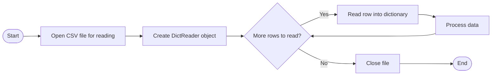

# Reading and Writing CSV Files

---
src: ./u3o1_tracking.md
hide: false
---

---
layout: top-title
color: blue
zoom: 1.2
class: ns-c-tight
---

::title::

# CSV Files

::content::

**CSV Files** are a common file format used to store tabular (table-like) data. CSV stands for **Comma-Separated Values**. Each line in a CSV file represents a row of data, and the values in each row are separated by commas. Values are often enclosed in double quotes, especially if they contain commas or other special characters.

CSV is a very popular export/import format for spreadsheets and databases, making it a common choice for data exchange.

In Python, we use the built-in `csv` module to read from and write to CSV files. This module provides functionality to handle CSV files in a way that is more robust and efficient than manually parsing the file.

```csv

Name,Age,City
Ahmed,30,Sydney
Bob,25,Los Angeles
Carlotta,35,Madrid
```

---
layout: top-title
color: blue
zoom: 1
class: ns-c-tight
---

::title::

# Reading CSV Files

::content::

To read our CSV files, we are going to use the `csv.DictReader` class. This class reads the CSV file and maps the information into a dictionary, where the keys are the column headers and the values are the corresponding data for each row.


## Absolute basics:


```python

import csv

with open('data.csv', mode='r') as file:
    csv_reader = csv.DictReader(file)
    
    for row in csv_reader:
        print(row['Name'], row['Age'], row['City'])
```

---
layout: top-title-two-cols
color: blue
zoom: 1.15
class: ns-c-tight
---

::title::

# Storing the results: list of dictionaries

::left::

A good way to store this data is as a  **list of dictionaries**, where each dictionary represents a row of data from the CSV file. 

- Each dictionary's keys correspond to the column headers
- The values in the dictionary match the data values

So for my file:

```csv
Name,Age,City
Ahmed,30,Sydney
Bob,25,Los Angeles
Carlotta,35,Madrid
```
::right::

The list of dictionaries would look like this in Python:

```python
data = [
    {'Name': 'Ahmed', 'Age': '30', 'City': 'Sydney'},
    {'Name': 'Bob', 'Age': '25', 'City': 'Los Angeles'},
    {'Name': 'Carlotta', 'Age': '35', 'City': 'Madrid'}
]
```

We create this list of dictionaries by appending the DictReader's output to a list.
```python
import csv
data = []
with open('data.csv', mode='r') as file:
    csv_reader = csv.DictReader(file)
    
    for row in csv_reader:
        data.append(row)
```


---
layout: top-title-two-cols
color: blue
zoom: 1.2
class: ns-c-tight
---

::title::

# Accessing the data

::left::

Once we have our data stored as a list of dictionaries, we can easily access specific pieces of information using the keys of the dictionaries.

- The **name of the first person** would be accessed as `data[0]['Name']` which would return "Ahmed".
- The **city of the second person** would be accessed as `data[1]['City']` which would return "Los Angeles".

::right::

- If I wanted to calculate the **average age** in my file, I could:
```python

total_age = 0
for row in data:
    total_age += int(row['Age'])
average_age = total_age / len(data)
```
