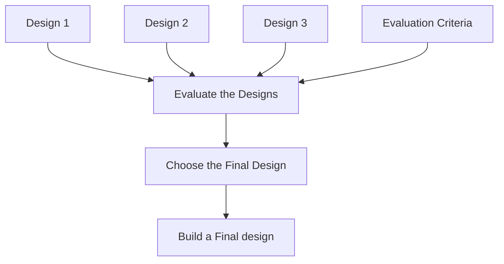

# Design Tools

---
layout: top-title-two-cols
color: blue-light
zoom: 1
---

::title::

# SAT Design Process

::left::

::right::

- Your intial designs are rough and simple - they need to focus on communicating the ideas, not on looking good.
- The evaluation criteria are the most important part of the process - they are what you will use to choose the best design, and they should be based on the requirements of the project.
- Your final design should usually be based on one of your initial designs, but incorporate elements of other designs in response to the evaluation criteria.

---
layout: top-title-two-cols
color: blue-light
zoom: 1.2
class: ns-c-tight
---

::title::

# Design Tools

::left::

The Study Design lists a number of design tools we use for ideation and designing the software. 

- mood boards
- brainstorming
- mind maps
- sketches
- annotations

<SpeechBubble color="blue-light">

Mood boards and brainstorming are especially useful for coming up with a wide range of ideas and exploring different possibilities

</SpeechBubble>

::right::

<SpeechBubble color="green-light">

 Mind maps are useful for organizing and structuring your ideas, and for identifying connections between different concepts

</SpeechBubble>

<SpeechBubble color="orange-light">

Sketches are useful for quickly communicating your ideas to others, and for exploring different design options

</SpeechBubble>
<SpeechBubble color="purple-light">

Annotations are useful for adding notes and comments to your designs, and for keeping track of your design decisions

</SpeechBubble>

---
