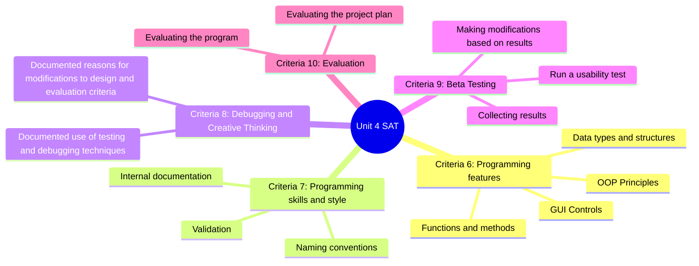
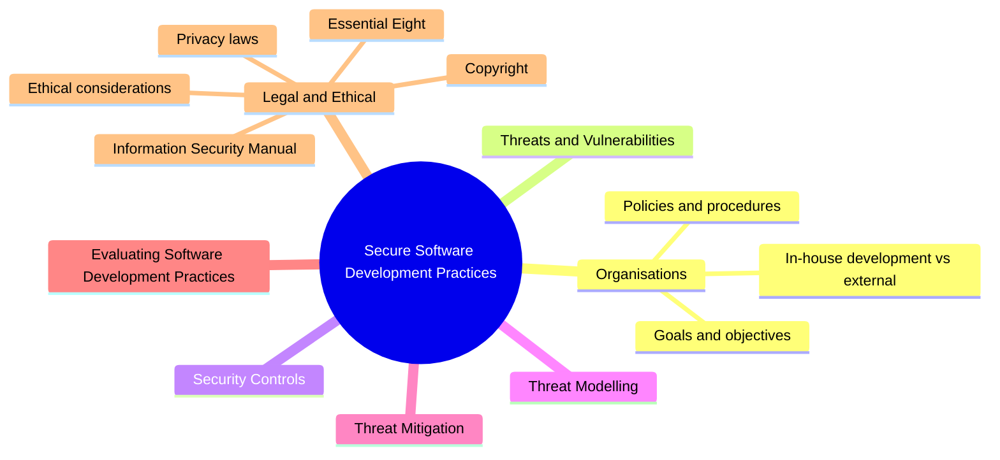

# Welcome to Unit 4

## Development, Evagluation and Cyber Security

---
layout: top-title
color: blue-light
zoom: 1
---
::title::

# Unit 4 SAT Work

::content::

Submit your program and testing.
Run your usablity test and change your program and re-submit.
Complete an evaluation.

---
layout: top-title
color: blue-light
zoom: 1
---

::title::

# Unit 4 Outcome 2 - Cyber Security

::content::

## Secure Software Development Practices

