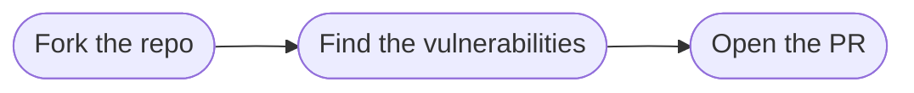

# Code Review Activity
## Secure Software Development

---
layout: top-title
color: green
zoom: 1.5
---

::title::

# The Scenario

::content::

You've inherited a colleague's script.

It works — but does it hold up under a security review?

---
layout: top-title
color: green
zoom: 1.5
---

::title::

# Your Task

::content::

1. Review `vulnerable_app.py` against a checklist of common vulnerabilities
2. Leave comments on a GitHub Pull Request, like a real code review
3. (Extension) Fix what you find, submit a second PR

*(More detailed instructions are in the repo's README.)*

---
layout: top-title
color: green
zoom: 1.5
---

::title::

# Why This Matters

::content::

Matches real industry practice:

- Code review as a security control
- Version control and pull requests as the review mechanism
- Identifying risk before it reaches production

---
layout: top-title
color: green
zoom: 1.6
---

::title::

# Let's Get Started

::content::

