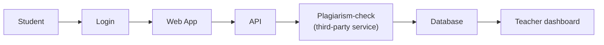
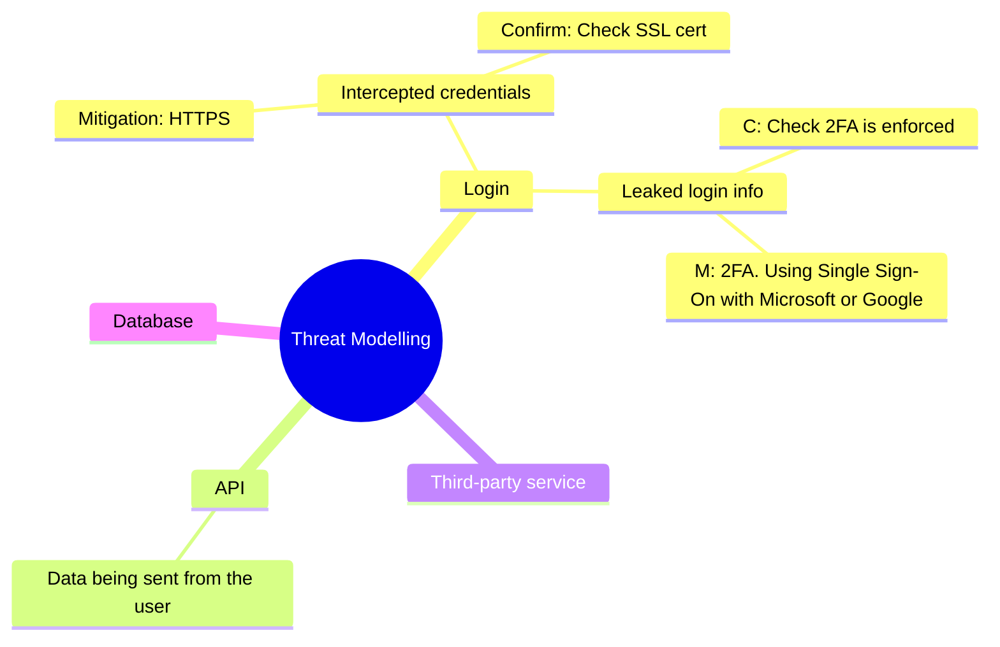

::title::

# Threat Modelling

::content::

## A School Assessment Submission System

---
layout: top-title
color: green
zoom: 1.5
---

::title::

# The Scenario

::content::

An online system for submitting assessments and returning marks.

You'll think like an attacker to find weaknesses — then like a security
engineer to fix them.

---
layout: top-title
color: green
zoom: 1.5
---

::title::

# The Full Picture

::content::



Every added component is a new place something can go wrong.

The school also runs a **staging (test) version** of this system, used
to trial updates before they go live. Keep that in mind for later.

---
layout: top-title
color: green
zoom: 1.1
---

::title::

# The Five-Stage Process

::content::

| Stage | Question |
| --- | --- |
| 1. Security requirements | What must we protect? |
| 2. Identify threats | How could something go wrong? |
| 3. Assess threats | Which threats are most serious? |
| 4. Mitigate | What control should we implement? |
| 5. Confirm | How would we know the control actually works? |

Stage 5 is the one people skip. **Don't.**

---
layout: top-title
color: green
zoom: 1.5
---

::title::

# Worked Example

::content::

**Threat:** Someone intercepts a user's credentials in transit.

**Control:** Encryption / TLS.

**Confirm:** Check `https://` is enforced, the SSL certificate is valid,
and the connection can't be downgraded to plain HTTP.

Proposing a control isn't the finish line — confirming it works is.

---

# Pair Assignments

| Pair | Focus area |
| --- | --- |
| 1 | Login |
| 2 | API |
| 3 | Third-party service |
| 4 | Database |

**40 minutes.** Work through all five stages for your focus area.

---
layout: top-title
color: green
zoom: 1.5
---

::title::

# Share Back

::content::



---
layout: top-title
color: green
---

::title::

# Stage 3: The Staging Server

::content::

> **The IT team is testing a new feature on the staging server**. Staging uses a full copy of the live student database (refreshed weekly) and the same admin login as production, because keeping two sets of credentials was "extra hassle."
>
> While testing, a developer runs a script meant to email a test batch of "sample" students to check a new notifications feature. The script pulls from the database — which, because it's the live copy, contains every real student's actual name, email, and current (unreleased) assessment marks.
>
> The script should run against the staging email service, but a leftover config value from an earlier test points it at the live email server instead. 314 real students receive an email that includes their actual (not-yet-released) marks.

From the company Slack:

```bash
#dev-staging — 2:14pm
jai: running the notify test now, using the student list from the DB
jai: wait why did that just go out to real addresses
jai: oh no the mail config still has prod creds from last week
```

Same five stages. **30 minutes.**

---
